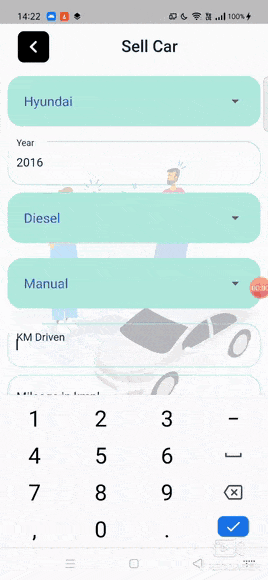

<div align="center">


[](https://flutter.dev/docs)
[](https://firebase.flutter.dev/docs/firestore/usage/ "Firestore")
[](https://jupyter.org/try)
[](https://code.visualstudio.com/  "Visual Studio Code")

</div><p align="center">
  <!-- <a href="" rel="noopener">
 </a> -->
 
</p>
<h1 align = 'center'><b>Car Buddy</b></h1>

## Description ##

The focus of the project is developing machine learning model that can accurately predict the price of a used car based on its features, in order to make informed purchases. Along with that, giving options to sell, view and search cars in the app.This app would help buyers connect to the sellers. The app would also validate the image by detecting the car in the picture uploaded by the user while regestering of his/her car.

<!--
<p>
For more details-
<a href="">
Document link 
</a>
</p>
-->

------------------------------------------
## Features ##

<b>User</b> 
- User authentication
- Home Page 
- Wishlist 
- Search option with different filters
- Predict used car price prediction 
- Sell car page
- Validate car picture 
- Delete car from sell
- FAQ


 <b>Admin</b> 
- Admin authentication
- Approval of car for selling
- Statistical analysis such as:
    - Users who sell their cars
    - Users registered per month
    - Cars registered per month
    - Frequently sold car brands


------------------------------------------
## Demo ##


<table>
<tr>
<td>Sign Up/Sign In</td>
<td>User Functionalities </td>
<td>Filter</td>
</tr>
<tr>

<td></td>
<td></td>
<td></td>
</tr>
<br>
<tr>
<td>Sell Car</td>
<td>Predict Car-price</td>
<td>Admin analysis</td>
</tr>
<tr>

<td></td>
<td></td>
<td></td>
</tr>
</table>
### Sign Up/Sign In 


------------------------------------------

## How To Use
#### Software Requirements
VSCode or Android Studio

## Installation
Install the dependencies by running:
```html  
flutter pub get
```


#### Run using Command Prompt

```html
    flutter run
```
#### Steps to run the api

1. ``` cd api ```
2. ``` pip install requirement.txt ```
3. ``` cd price_pred_api ```
4. Run the command ``` ucivorn --reload main:app ``` to start the api


---
###             Tech stack
`Language` : Dart <br>
`Frontend` : Flutter  <br>
`Database` : Firestore <br>
`Authenication`: Firebase<br>
`ML library `: PyTorch<br>
`Framework for API `: FastAPI<br> 


<p>
For more details-
<a href="https://firebase.google.com/docs/functions/get-started">
 Firebase Cloud Functions  </a>
</p>

Flutter Documentation-
<a href="https://flutter.dev/docs">
 Flutter </a> 
</p>

Dart Programming-
<a href="https://dart.dev/guides">
 Dart </a> 
</p>
------------------------------------------

<h3 align="center"><b>Developed  by <a href="https://github.com/hasti-15">Hasti Shah</a> , <a href="https://github.com/Smit1400">Smit Shah</a> and <a href="https://github.com/hiral72">Hiral Sheth</a></b></h3>
